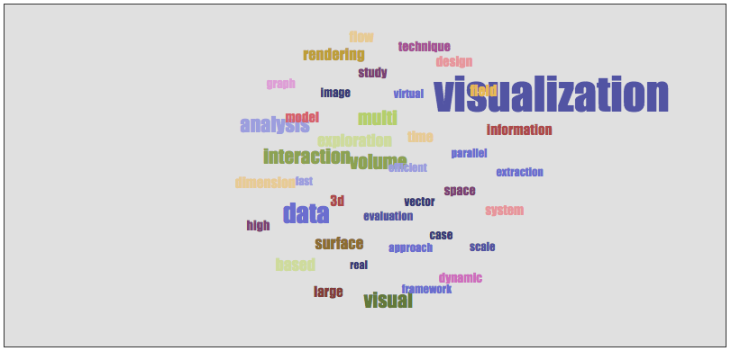
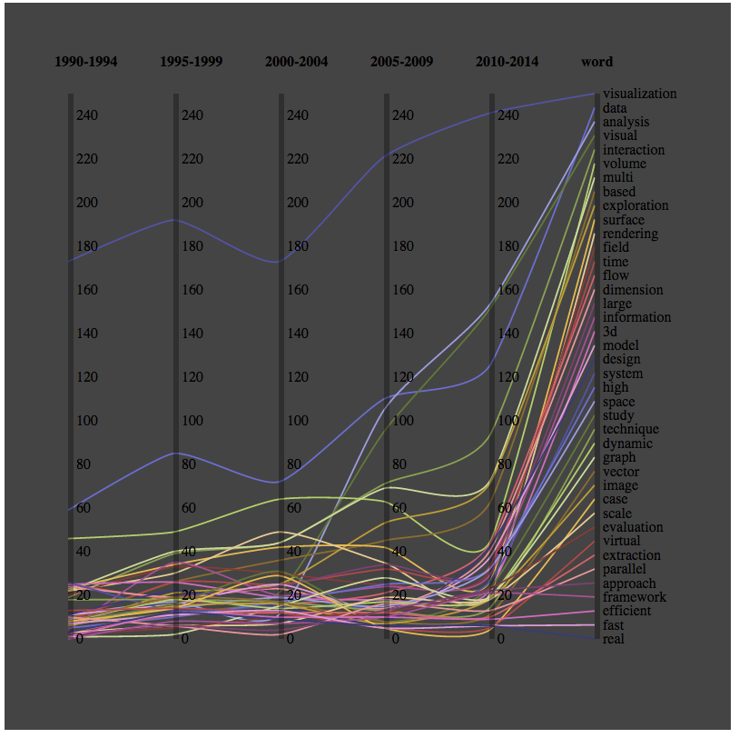

Visual Analytics Practical Assignment
=====================================

Completed tasks for grade S: (Level 1A, Level 1B, Level 2).

Level 1A: Features
------------------

 - Extracts tuples from '5 years' csv datasheet.
 - Visual representation is a 'Tag Cloud'
 - Displays all words
 - Each word appears in different sizes indicating the frequency of its occurrence
 - Words appear in different colours

Level 1A: Implementation Details
--------------------------------

Code for this visualisation is found in the file `vis.coffee`. It is based on a force directed layout and uses no existing libraries or examples.

There are two d3 scales that affect the presentation: `colourScale` and `fontSizeScale`.

Every data object is presented as an `svg` text element.

The force layout, `force`, updates all the texts after every `tick`.

Time used: ~2 hours.

Level 1B: Features
------------------

 - Extracts tuples from '5 years' csv datasheet.
 - Represents all 40 objects
 - Displays data as a parallel coordinates visualisation
 - There are 6 axes: '1990-1994', '1995-1999', '2000-2004', '2005-2009', '2010-2014' and 'word'
 - Each data object is represented as a single line, which intersects each of these axes.
 - Each year axis displays the number of occurrences of that word during that time interval.
 - Each axis is labelled.
 - Each axis is 'brushable' ie, you can use the mouse to highlight a particular interval of the axis and
   focus on these particular datapoints
 - The brushing utility is conjunctive - ie, only data objects that satisfy all brush selections will be highlighted
 - All axis have the range [0,250]

Level 1B: Implementation Details
--------------------------------

Code for this visualisation is found in `vis2.coffee`.  It uses no existing libraries or examples.

This visualisation is more complex that Level 1A, so I have endeavoured to modularise the source as much as possible.

The high level function calls are found at the end of the file. Essentially, we initialise as much of the visualisation as
possible before we load the data (ie container and axis labels).  Then we use d3's `csv` function to asynchronously load
the csv datasheet.  Required columns are then converted from strings to integers.

Then, we create an ordinal scale for the words (unlike the frequency scales which are simple linear scales).

Once we have a full list of scales, we transform the rows to tie each column to a parallel
coordinates axis (by introducing x-values).  These are then drawn as svg lines.  A high tension `cardinal` interpolation
helps follow one particular line through the whole visualisation.

Finally, we draw on the axes, ticks and set up brushing behaviour.
